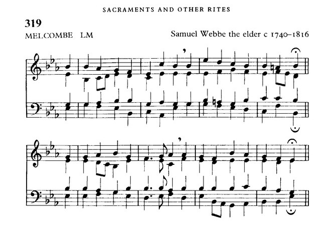
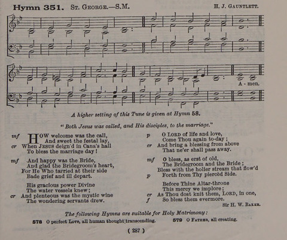
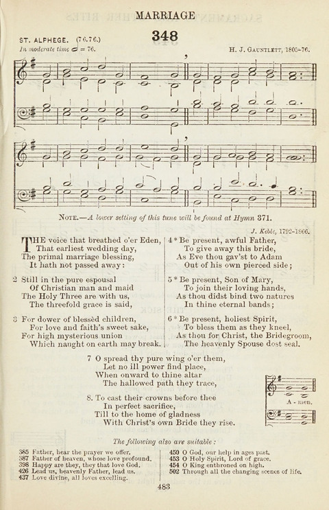
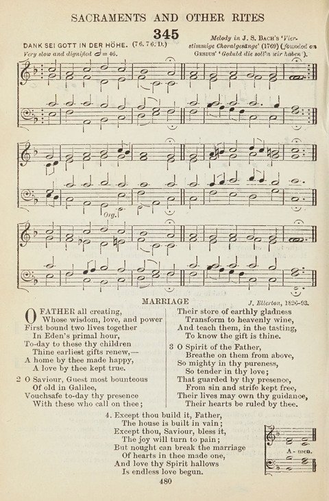

_\textcolor{red}{Please stand for the entrance of the Sacred Ministers.}_

_\textcolor{red}{The Sacred Ministers stand at the Chancel step. The Bride and Groom and their attendants likewise move to the Chancel step.}_

_\textcolor{red}{At the day and time appointed for solemnization of Matrimony, the persons to be married shall come into the Body of the Church with their friends and neighbours: and there standing together, the Man on the right hand, and the Woman on the left, the Priest shall say,}_

Dearly beloved, we are gathered together here in the sight of God, his angels and all the saints, and in the face of the Church, to join together two bodies, to wit, those of this man and this woman in holy Matrimony;
which is an honourable estate, instituted of God in the time of man's innocency, signifying unto us the mystical union that is betwixt Christ and his Church;
which holy estate Christ adorned and beautified with his presence, and first miracle that he wrought, in Cana of Galilee;
and is commended of Saint Paul to be honourable among all men: and therefore is not by any to be enterprised, nor taken in hand, unadvisedly, lightly, or wantonly, to satisfy men's carnal lusts and appetites, like brute beasts that have no understanding;
but reverently, discreetly, advisedly, soberly, and in the fear of God;
duly considering the causes for which Matrimony was ordained.

First, It was ordained for the procreation of children, to be brought up in the fear and nurture of the Lord, and to the praise of his holy Name.

Secondly, It was ordained for a remedy against sin, and to avoid fornication;
that such persons as have not the gift of continency might marry, and keep themselves undefiled members of Christ's body.

Thirdly, It was ordained for the mutual society, help, and comfort, that the one ought to have of the other, both in prosperity and adversity.
Into which holy estate these two persons present come now to be joined.
Therefore if any man can shew any just cause, why they may not lawfully be joined together, let him now speak, or else hereafter for ever hold his peace.

_\textcolor{red}{And also, speaking unto the persons that shall be married, he shall say,}_

I require and charge you both, as ye will answer at the dreadful day of judgement, when the secrets of all hearts shall be disclosed, that if either of you know any impediment, why ye may not be lawfully joined together in Matrimony, ye do now confess it.
For be ye well assured, that so many as are coupled together otherwise than God's Word doth allow are not joined together by God; neither is their Matrimony lawful.

_\textcolor{red}{At which day of Marriage, if any man do allege and declare any impediment, why they may not be coupled together in Matrimony, by God's law, or the laws of this Realm; and will be bound, and sufficient sureties with him, to the parties;
or else put in a caution (to the full value of such charges as the persons to be married do thereby sustain) to prove his allegation: then the solemnization must be deferred, until such time as the truth be tried.}_

## Solemnization of Matrimony

_\textcolor{red}{If no impediment be alleged, then shall the Priest say unto the Man,}_

Oliver, wilt thou have this woman to thy wedded wife, to live together after God's ordinance in the holy estate of Matrimony?
Wilt thou love her, comfort her, honour, and keep her in sickness and in health; and, forsaking all other, keep thee only unto her, so long as ye both shall live?

_\textcolor{red}{The Man shall answer,}_ I will.

_\textcolor{red}{Then shall the Priest say unto the Woman,}_

Caitlin, wilt thou have this man to thy wedded husband, to live together after God's ordinance in the holy estate of Matrimony?
Wilt thou obey him, and serve him, love, honour, and keep him in sickness and in health; and, forsaking all other, keep thee only unto him, so long as ye both shall live?

_\textcolor{red}{The Woman shall answer,}_ I will.

_\textcolor{red}{Then shall the Priest say,}_

Who giveth this woman to be married to this man?

_\textcolor{red}{Then shall they give their troth to each other in this manner.}_

_\textcolor{red}{The Minister receiving the woman at her father's hands, shall cause the man with his right hand to take the woman by her right hand, and to say after him as followeth.}_

I Oliver take thee Caitlin to my wedded wife, to have and to hold from this day forward, for better for worse, for richer for poorer, in sickness and in health, to love and to cherish, till death us do part, according to God's holy ordinance; and thereto I plight thee my troth.

_\textcolor{red}{Then shall they loose their hands; and the woman with her right hand taking the man by his right hand, shall likewise say after the Minister.}_

I Caitlin take thee Oliver to my wedded husband, to have and to hold from this day forward, for better for worse, for richer for poorer, in sickness and in health, to love, cherish, and to obey, till death us do part, according to God's holy ordinance; and thereto I give thee my troth.

_\textcolor{red}{Then shall they again loose their hands; and each shall give unto the other a ring, laying the same upon the book.}_

The Lord be with you;\
**And with thy spirit.**

Let us pray.

O Creator and preserver of mankind, giver of spiritual grace, bestower of eternal salvation, do Thou, O Lord, send Thy bles\+sing on these rings,
that they who shall wear them may be armed with the strength of heavenly defence, and that it may be profitable unto their eternal salvation.
Through Christ our Lord.
**Amen.**

Let us pray.

Bl\+ess, O Lord, these rings which we hallow in Thy Holy Name, that they who shall wear them may be stedfast in Thy peace and abide in Thy will, and
live, increase, and grow old in Thy love, and let the length of their days be multiplied.
Through Christ our Lord.
**Amen.**

_\textcolor{red}{And the Priest, taking a ring, shall deliver it unto the man, to put it upon the fourth finger of the woman's left hand.
And the man holding the ring there and taught by the Priest, shall say,}_

With this ring I thee wed, with my body I thee worship, and with all my worldly goods I thee endow: In the name of the Father, and of the Son, and of the Holy Ghost. Amen.

_\textcolor{red}{Then the Priest, taking the other ring, shall deliver it unto the woman, to put it upon the fourth finger of the man's left hand.
And the woman holding the ring there, and taught by the Priest, shall say,}_

With this ring I thee wed, with my body I thee worship, and with all my worldly goods I thee endow: In the name of the Father, and of the Son, and of the Holy Ghost. Amen.

_\textcolor{red}{Then they shall both kneel down; and the Minister shall say,}_

Let us pray.

O Eternal God, Creator and Preserver of all mankind, giver of all spiritual grace, the author of everlasting life:
Send thy blessing upon these thy servants, this man and this woman, whom we bless in thy name;
that, as Isaac and Rebecca lived faithfully together, so these persons may surely perform and keep the vow and covenant betwixt them made,
(whereof these rings given and received are a token and pledge,) and may ever remain in perfect love and peace together, and live according to thy laws;
through Jesus Christ our Lord.\
**Amen.**

_\textcolor{red}{Then shall the Priest join their right hands together, and say,}_

Those whom God hath joined together let no man put asunder.

_\textcolor{red}{Then shall the Minister speak unto the people.}_

Forasmuch as Oliver and Caitlin have consented together in holy wedlock,
and have witnessed the same before God and this company,
and thereto have given and pledged their troth either to other,
and have declared the same by giving and receiving of rings, and by joining of hands;
I pronounce that they be man and wife together,
In the name of the Father, and of the Son, and of the Holy Ghost.\
**Amen.**

_\textcolor{red}{And the Minister shall add this Blessing}_

God the Father, God the Son, God the Holy Ghost, bless, preserve, and keep you;
the Lord mercifully with his favour look upon you; and so fill you with all spiritual benediction and grace,
that ye may so live together in this life, that in the world to come ye may have life everlasting.\
**Amen.**

## Signing of the Marriage Certificate

_\textcolor{red}{The marriage certificates are then signed.}_

_\textcolor{red}{While the marriage certificates are signed, the choir will sing the following:}_

Thomas Tallis (1505 - 1585), If Ye Love Me

## Introit Hymn - NEH 319

O God, whose loving hand has led \
Thy children to this joyful day, \
We pray that Thou wilt bless them now \
As, one in Thee, they face life's way.

Grant them the will to follow Christ \
Who graced the feast in Galilee, \
And through his perfect life of love \
Fulfilment of their love to see.

Give them the power to make a home \
Where peace and honour shall abide, \
Where Christ shall be the gracious head, \
The trusted friend, the constant guide.

## Collect for Purity

Let us pray. _\textcolor{red}{(Please kneel)}_

**Almighty God, unto whom all hearts be open, all desires known, and from whom no secrets are hid: Cleanse the thoughts of our hearts by the inspiration of thy Holy Spirit, that we may perfectly love thee, and worthily magnify thy holy name; through Christ our Lord.**\
**Amen.**

## Introit - Tobit 7:14; 8:19; Psalm 128:1

The God of Israel make you one, / and may he be with you even as he had mercy of two that were the only begotten of their fathers:\
**grant them mercy, O Lord, / and finish their life in health with joy.**\
Blessed are all they that fear the Lord:\
**and walk in his ways.**\
Glory be to the Father, and to the Son: and to the Holy Ghost;\
**As it was in the beginning, is now, and ever shall be: world without end. Amen.**

## The Kyries

John Taverner (1490 - 1545), Kyrie Le Roy

## Gloria

Thomas Tallis (1505 - 1585), Missa Sine Nomine

## Wedding Collect

The Lord be with you;\
**And with thy spirit.**

Let us pray. _\textcolor{red}{(Please kneel)}_

O Eternal God, we humbly beseech thee, favourably to behold thy servants Oliver and Caitlin now joined in wedlock according to thy holy ordinance:
and grant that they, seeking first thy kingdom and thy righteousness, may obtain the manifold blessings of thy grace;
through Jesus Christ thy Son our Lord, who liveth and reigneth with thee, in the unity of the Holy Ghost, ever one God, world without end.\
**Amen.**

## The First Reading - Genesis 2:18-24

And the Lord God said, It is not good that the man should be alone; I will make him an help meet for him.
And out of the ground the Lord God formed every beast of the field, and every fowl of the air; and brought them unto Adam to see what he would call them: and whatsoever Adam called every living creature, that was the name thereof.
And Adam gave names to all cattle, and to the fowl of the air, and to every beast of the field; but for Adam there was not found an help meet for him.
And the Lord God caused a deep sleep to fall upon Adam, and he slept: and he took one of his ribs, and closed up the flesh instead thereof;
And the rib, which the Lord God had taken from man, made he a woman, and brought her unto the man.
And Adam said, This is now bone of my bones, and flesh of my flesh: she shall be called Woman, because she was taken out of Man.
Therefore shall a man leave his father and his mother, and shall cleave unto his wife: and they shall be one flesh.

## Gradual - Psalm 128:1-4

Blessed are all they that fear the Lord, and walk in his ways:\
**for thou shalt eat the labours of thy hands; / O well is thee and happy shalt thou be.**\
Thy wife shall be as the fruitful vine, upon the walls of thine house:\
**thy children like the olive branches, round about thy table.**

## The Epistle - Ephesians 5:20-33

Giving thanks always for all things unto God and the Father in the name of our Lord Jesus Christ;
Submitting yourselves one to another in the fear of God.
Wives, submit yourselves unto your own husbands, as unto the Lord.
For the husband is the head of the wife, even as Christ is the head of the church: and he is the saviour of the body.
Therefore as the church is subject unto Christ, so let the wives be to their own husbands in every thing.
Husbands, love your wives, even as Christ also loved the church, and gave himself for it;
That he might sanctify and cleanse it with the washing of water by the word,
That he might present it to himself a glorious church, not having spot, or wrinkle, or any such thing; but that it should be holy and without blemish.
So ought men to love their wives as their own bodies. He that loveth his wife loveth himself.
For no man ever yet hated his own flesh; but nourisheth and cherisheth it, even as the Lord the church:
For we are members of his body, of his flesh, and of his bones.
For this cause shall a man leave his father and mother, and shall be joined unto his wife, and they two shall be one flesh.
This is a great mystery: but I speak concerning Christ and the church.
Nevertheless let every one of you in particular so love his wife even as himself; and the wife see that she reverence her husband.

## Gradual Hymn A&M 351

How welcome was the call, \
And sweet the festal lay, \
When Jesus deigned in Cana's hall \
To bless the marriage day!

And happy was the bride, \
And glad the Bridegroom's heart, \
For He Who tarried at their side \
Bade grief and ill depart.

His gracious power Divine \
The water vessels knew; \
And plenteous was the mystic wine \
The wondering servants drew.

O Lord of life and love, \
Come Thou again today; \
And bring a blessing from above \
That ne'er shall pass away.

O bless as erst of old, \
The Bridegroom and the Bride; \
Bless with the holier stream that flowed \
Forth from Thy piercèd Side.

Before Thine Altar-throne \
This mercy we implore; \
As Thou dost knit them, Lord, in one, \
So bless them evermore.

## Alleluia Psalm 20:2

Alleluia. **Alleluia.**\
The Lord send you help from the sanctuary:\
**and strengthen you out of Sion. Alleluia.**

## The Gospel - Mark 10:1-16

And he arose from thence, and cometh into the coasts of Judaea by the farther side of Jordan: and the people resort unto him again; and, as he was wont, he taught them again.
And the Pharisees came to him, and asked him, Is it lawful for a man to put away his wife? tempting him.
And he answered and said unto them, What did Moses command you?
And they said, Moses suffered to write a bill of divorcement, and to put her away.
And Jesus answered and said unto them, For the hardness of your heart he wrote you this precept.
But from the beginning of the creation God made them male and female.
For this cause shall a man leave his father and mother, and cleave to his wife;
And they twain shall be one flesh: so then they are no more twain, but one flesh.
What therefore God hath joined together, let not man put asunder.
And in the house his disciples asked him again of the same matter.
And he saith unto them, Whosoever shall put away his wife, and marry another, committeth adultery against her.
And if a woman shall put away her husband, and be married to another, she committeth adultery.
And they brought young children to him, that he should touch them: and his disciples rebuked those that brought them.
But when Jesus saw it, he was much displeased, and said unto them, Suffer the little children to come unto me, and forbid them not: for of such is the kingdom of God.
Verily I say unto you, Whosoever shall not receive the kingdom of God as a little child, he shall not enter therein.
And he took them up in his arms, put his hands upon them, and blessed them.

## Sermon

## Offertory Sentence - Colossians 3:14-15

Above all things put on love, which binds everything together in perfect harmony:\
**and let the peace of Christ rule in your hearts, and be ye thankful.**

## Offertory Hymn - EH 348

The voice that breathed o'er Eden, \
That earliest wedding day, \
The primal marriage blessing, \
It hath not pass'd away:

Still in the pure espousal \
Of Christian man and maid \
The Holy Three are with us, \
The threefold grace is said,

For dower of blessèd children, \
For love and faith's sweet sake, \
For high mysterious union \
Which naught on earth may break.

Be present, awful Father, \
To give away this bride, \
As Eve Thou gav'st to Adam \
Out of his own pierced side;

Be present, Son of Mary, \
To join their loving hands, \
As thou didst bind two natures \
In thine eternal bands;

Be present holiest Spirit, \
To bless them as they kneel, \
As thou for Christ the Bridegroom, \
The heavenly Spouse dost seal.

O spread thy pure wing o'er them, \
Let no ill power find place, \
When onward to thine altar \
The hallow'd path they trace,

To cast their crowns before thee \
In perfect sacrifice, \
Till to the home of gladness \
With Christ's own Bride they rise.

## Offertory Prayer

O Lord, we beseech thee, to accept this gift which, as ordained by thy holy law of matrimony,
we present unto thee: and grant that this work begun by the bounty of thy goodness,
may in all things be disposed according to thy will; through Jesus Christ our Lord.\
**Amen.**

## Invitation to Confession

Ye that do truly and earnestly repent you of your sins, and are in love and charity
with your neighbours, and intend to lead a new life, following the
commandments of God, and walking from henceforth in his holy ways; Draw
near with faith, and take this Holy Sacrament to your comfort; and make your
humble confession to Almighty God, meekly kneeling upon your knees.

## The General Confession

**Almighty God,\
Father of our Lord Jesus Christ,\
Maker of all things,\
Judge of all men:\
We acknowledge and bewail our manifold sins and wickedness,\
Which we, from time to time, most grievously have committed,\
By thought, word, and deed,\
Against Thy Divine Majesty,\
Provoking most justly Thy wrath and indignation against us.\
We do earnestly repent,\
And are heartily sorry for these our misdoings;\
The remembrance of them is grievous unto us;\
The burden of them is intolerable.\
Have mercy upon us,\
Have mercy upon us, most merciful Father;\
For Thy Son, our Lord Jesus Christ's sake,\
Forgive us all that is past;\
And grant that we may ever hereafter\
Serve and please Thee\
In newness of life,\
To the honour and glory of Thy Name;\
Through Jesus Christ our Lord.\
Amen.**

## The Absolution

Almighty God, our heavenly Father, who of his great mercy hath promised
forgiveness of sins to all them that with hearty repentance and true faith turn
unto him: Have mercy upon you; \+ pardon and deliver you from all your sins;
confirm and strengthen you in all goodness; and bring you to everlasting life;
through Jesus Christ our Lord. **Amen.**

## The Prayer of Humble Access

Let us pray.

**We do not presume to come to this thy Table,\
O merciful Lord,\
trusting in our own righteousness,\
but in thy manifold and great mercies.\
We are not worthy so much as to gather up the crumbs under thy Table.\
But thou art the same Lord,\
Whose property is always to have mercy:\
Grant us therefore, gracious Lord,\
so to eat the Flesh of thy dear Son Jesus Christ,\
and to drink his Blood,\
That our sinful bodies may be made clean by his Body,\
and our souls washed through his most precious Blood,\
and that we may evermore dwell in him, and he in us. Amen.**

## The Preface

The Lord be with you;\
**And with thy spirit.**

Lift up your hearts;\
**We lift them up unto the Lord.**

Let us give thanks unto our Lord God;\
**It is meet and right so to do.**

It is very meet, right, and our bounden duty, that we should at all times, and in
all places, give thanks unto thee, O Lord, Holy Father, Almighty, Everlasting God;
because in the love of husband and wife, thou hast given us an image of the union
of thy Son Jesus Christ with the heavenly Jerusalem, adorned as a bride for her bridegroom,
who loveth her and gave himself for her, that he might renew the whole creation.
Therefore with Angels and Archangels, and with all the company of heaven,
we laud and magnify thy glorious name, evermore praising thee, and singing,

## Sanctus and Benedictus

Thomas Tallis (1505 - 1585), Missa Sine Nomine

## The Prayer of Consecration

All Glory be to thee, Almighty God, our heavenly Father, who of thy
tender mercy didst give thine only Son Jesus Christ to suffer death upon the
cross for our redemption; who made there (by his one oblation of himself
once offered) a full, perfect, and sufficient sacrifice, oblation, and satisfaction
for the sins of the whole world; and did institute, and in his holy Gospel
command us to continue, a perpetual memory of that his precious death until his coming again;

_\textcolor{red}{The sanctuary bells are rung to prepare us for the Lord's sacramental presence.}_

Hear us, O merciful Father, we most humbly beseech thee; and grant that we
receiving these thy creatures of bread and wine, according to thy Son our
Saviour Jesus Christ's holy institution, in remembrance of his death and
passion, may be partakers of his most blessed body and blood.

Who, in the same night that he was betrayed, took Bread; and when he had
given thanks, he brake it, and gave it to his disciples, saying,

Take, eat, this is my Body which is given for you; Do this in remembrance of me. \+

_\textcolor{red}{The sanctuary bells are rung to call us to adoration.}_

Likewise after supper, he took the Cup; and when he had given thanks, he gave it to them, saying,

Drink ye all of this; for this is my Blood of the New Covenant,
which is shed for you and for many for the remission of sins:
Do this, as oft as ye shall drink it, in remembrance of me. \+

_\textcolor{red}{The sanctuary bells are rung again.}_

Wherefore, O Lord and Heavenly Father, we thy humble
servants, having in remembrance the precious death and passion of thy dear
Son, his mighty resurrection and glorious ascension, according to his holy
institution, do celebrate, and set forth before thy Divine Majesty with these thy
holy gifts, the memorial which he hath willed us to make, rendering unto thee
most hearty thanks for the innumerable benefits which he hath procured unto us.

And we entirely desire thy fatherly goodness mercifully to accept this our
sacrifice of praise and thanksgiving; most humbly beseeching thee to grant,
that by the merits and death of thy Son Jesus Christ, and through faith in his
blood, we and all thy whole Church may obtain remission of our sins, and all
other benefits of his passion.

And here we offer and present unto thee, O Lord, ourselves, our souls, and
bodies, to be a reasonable, holy, and living sacrifice unto thee; humbly
beseeching thee, that all we, who are partakers of this Holy Communion, may
be fulfilled with thy grace and heavenly benediction.

And although we be unworthy, through our manifold sins, to offer unto thee
any sacrifice, yet we beseech thee to accept this our bounden duty and service;
not weighing our merits, but pardoning our offences;

Through Jesus Christ our Lord, by whom, and with whom, in the unity of the
Holy Ghost, all honour and glory be unto thee, O Father Almighty, world
without end.
**Amen.**

## The Lord's Prayer

**Our Father,\
Which art in heaven,\
Hallowed be Thy Name,\
Thy kingdom come;\
Thy will be done;\
In earth as it is in heaven.\
Give us this day our daily bread.\
And forgive us our trespasses\
As we forgive them that trespass against us.\
And lead us not into temptation;\
But deliver us from evil:\
For thine is the kingdom, the power and the glory.\
For ever and ever. \
Amen.**

## Prayers for the Couple

Save Thy servant and Thy handmaid,\
*My God, who put their trust in Thee.*\
O Lord, send them help from Thy holy place,\
*And defend them out of Sion.*\
Be unto them, O Lord, a tower of strength,\
*From the face of their enemy.*\
Lord, hear my prayer,\
*And let my cry come unto Thee.*\
The Lord be with you,\
*And with thy spirit.*

Let us pray.

The Lord bless you out of Sion, that ye may behold Jerusalem in prosperity all the days of your life, and see your children's children and peace upon Israel.
Through Christ our Lord.
**Amen.**

Let us pray.

O God of Abraham, God of Isaac, God of Jacob, bless these young persons, and sow the seed of eternal life in their hearts; that whatsoever they shall profitably learn, they may indeed fulfil the same. Through Jesus Christ Thy Son, restorer of man.
Who liveth and reigneth with thee in the unity of the Holy Ghost, one God, world without end.
**Amen.**

Let us pray.

Look down from Heaven, O Lord, and bless this congregation; and as Thou sentest Thy holy Angel Raphael to Tobias, and to Sarah, the daughter of Raguel, so vouchsafe, O Lord, to send Thy blessing upon these young persons, that they, obeying Thy will and always being in safety under Thy protection, may live, increase, and grow old in Thy love; and may be worthy, and peacemakers, and that the length of their days may be multiplied.
Through Christ our Lord.
**Amen.**

Let us pray.

Favourably regard, O Lord, this Thy servant and this Thy handmaid, that in Thy Name they may receive a heavenly benediction, see the children of their sons and daughters to the third and fourth generations in safety, ever remain steadfast in Thy will, and at length attain unto the Kingdom of Heaven.
Through Christ our Lord.
**Amen.**

Let us pray.

The Almighty and merciful God, Who by His own power did create our first parents Adam and Eve, and by His own consecration did knit them together; Himself sanctify and bless your souls and bodies, and join you together in the union and love of true affection.
Through Christ our Lord.
**Amen.**

God Almighty bless you with all heavenly benediction, and make you worthy in His sight, pour upon you the riches of His grace, and instruct you in the Word of Truth, that ye may be enabled to please Him alike in body and soul.
Through Christ our Lord.
**Amen.**

_\textcolor{red}{The Bride and Groom shall kneel before the Altar.}_\
_\textcolor{red}{A pall or veil being held over them, which four of the clergy in surplices hold at the four corners.}_\
_\textcolor{red}{Then before The Peace of the Lord, after making the Eucharistic fraction in the usual manner, and having left the Host on the paten in three pieces, let the Priest turn to them and say these prayers reading, as they kneel under the pall}_

The Lord be with you, \
**And with thy spirit.**

Let us pray.

Be favourable, O Lord, unto our supplications, and of Thy goodness assist the ordinances whereby Thou hast appointed that mankind should be increased; that they who are joined together by Thy allowance may be preserved by Thy succour.
Through Christ our Lord.
**Amen.**

Let us pray.

O God, Who by Thy mighty power madest all things out of
nothing; Who also, after other things set in order, didst create
for man, made after the image of God, the inseparable help of
the woman, that out of man's flesh woman should take her
beginning, teaching that what Thou hast been pleased to make
one it should never be lawful to put asunder. O God, Who
hast consecrated the state of matrimony to such an excellent
mystery, that in it is signified the sacramental union and marriage
of Christ and the Church; O God, by Whom woman is joined
to man, and the union, instituted in the beginning, is gifted with
that bles\+sing which alone has not been taken away either
through penalty of original sin or the judgement of the deluge;
look graciously, we beseech Thee, on this Thine
handmaid now joined in wedlock, who earnestly desireth to
be guarded by Thy protection. Let the yoke of love and peace be
upon her; let her be faithful and chaste; let her wed in Christ
and ever remain a follower of holy matrons. Let her be loving
to her husband as Rachel, wise as Rebecca, long-lived and
faithful as Sara. Let not the father of lies get advantage
over her through her doings; let her abide in the bond of faith and
precept; being wedded to one man, let her flee all unlawful
conversation, and fortify her weakness with the strength of discipline.
Let her be grave and bashful, severe and modest, well-instructed
in heavenly doctrine. Let her be fruitful in child-bearing, well
reported of, and innocent, and attain to a desired old age, seeing
her children’s children unto the third and fourth generation, and
finally attaining unto the rest of the blessed and the Kingdom of Heaven.
Through Jesus Christ our Lord. **Amen.**

## The Pax

The peace of the Lord be alway with you;\
**And with thy spirit.**

_\textcolor{red}{Let the pall now be removed}_

## Agnus Dei

Thomas Tallis (1505 - 1585), Missa Sine Nomine

## Communion

_\textcolor{red}{The couple shall receive Communion first.}_

Thomas Tallis (1505 - 1585), A New Commandment

## Communion Sentence - Psalm 37:3-4

Put thou thy trust in the Lord, and be doing good; dwell in the land, and verily thou shalt be fed:\
**delight thou in the Lord; and he shall give thee thy heart’s desire.**

## The Post Communion Prayer

We beseech Thee, O Almighty God, further
the ordinance of Thy Providence with compassion and love, and
keep in peace unto old age those whom Thou joinest together in lawful union;
Through Jesus Christ our Lord.\
**Amen.**

## The Dismissal and Solemn Blessing

The Lord be with you; \
**And with thy spirit.**

Depart in Peace; \
**Thanks be to God.**

The peace of God, which passeth all understanding, keep your hearts and minds
in the knowledge and love of God, and of his Son Jesus Christ our Lord: and the
blessing of God Almighty, \+ the Father, the Son, and the Holy Ghost, be amongst
you and remain with you always. **Amen.**

## Post Communion Hymn - EH 345

O Father all creating,\
Whose wisdom, love, and power\
First bound two lives together\
In Eden's primal hour,\
Today to these thy children\
Thine earliest gifts renew,\
A home by thee made happy,\
A love by thee kept true.

O Saviour, Guest most bounteous\
Of old in Galilee,\
Vouchsafe today Thy presence\
With these who call on Thee;\
Their store of earthly gladness\
Transform to heavenly wine,\
And teach them, in the tasting\
To know the gift is Thine.

O Spirit of the Father,\
Breathe on them from above,\
So mighty in Thy pureness,\
So tender in Thy love;\
That guarded by Thy presence,\
From sin and strife kept free,\
Their lives may own Thy guidance,\
Their hearts be ruled by Thee.

Except Thou build it, Father,\
The house is built in vain;\
Except Thou, Saviour, bless it,\
The joy will turn to pain;\
But nought can break the marriage\
Of hearts in Thee made one,\
And love Thy Spirit hallows\
Is endless love begun.
